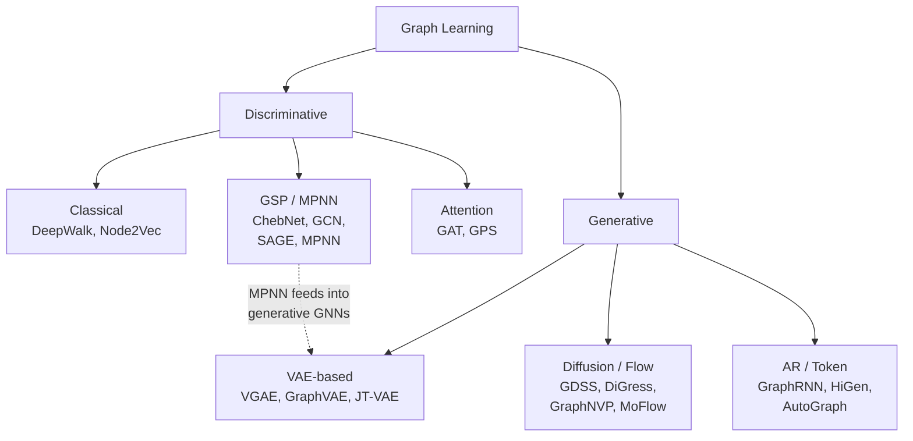

  

    
    

      Kaiwen Bian
      25 min read · Mar 12, 2026
    

  

Sometimes the relationships between things tell you more than the things themselves. A single atom's features don't tell you much --- but *how* it's bonded to its neighbors determines whether you're looking at a life-saving drug or a toxin. Data has shape to it, and that shape carries meaning. Graphs are a natural way to represent this: nodes hold features, edges encode relationships, and the topology itself is information. This article walks through how the field tackled that problem, from random walks to message passing to transformers, and then flipped the question entirely: can we learn to *generate* new graphs?

The roadmap looks something like this:

## Graph Learning Tasks

Before diving in, let's establish what we're trying to do. Given a graph $G=(V,E)$ with node features $X \in \mathbb{R}^{n \times d}$ and edge features $e_{ij}$, the main tasks are:

- **Node-level**: Classification ($f: v \to \{1\ldots C\}$) or regression ($f: v \to \mathbb{R}$). Think paper topic prediction in citation networks, traffic speed at sensors.
- **Edge-level**: Link prediction (does an edge exist?), edge classification. Think knowledge graph completion, bond type prediction.
- **Graph-level**: Classification/regression over entire graphs. Think molecular property prediction (QM9, ZINC), protein function.
- **Generation**: Learn $p_\theta(G)$ and sample novel graphs. Think drug design, material discovery.

The key intuition is: discriminative tasks *analyze* existing graphs ("what is this molecule?") while generative tasks *create* new ones ("design me a drug"). Both share the fundamental challenge of representing irregular graph structure for neural networks.

## Classical Methods: Random Walks

### DeepWalk (Perozzi et al., 2014)

The first big insight was surprisingly simple: random walks on graphs follow power-law distributions, just like word frequencies in language. So why not treat random walks as "sentences" and apply Word2Vec?

The algorithm generates random walks of fixed length from each node, then optimizes a skip-gram objective:

$$
\min_\Phi \; -\sum_{v_i \in \text{walk}} \sum_{\substack{j: i-w \leq j \leq i+w \\ j \neq i}} \log \Pr(v_j \mid \Phi(v_i))
$$

where $\Phi: V \to \mathbb{R}^d$ maps nodes to embeddings, $w$ is the context window, and the probability uses hierarchical softmax over a binary tree ($O(\log|V|)$ instead of $O(|V|)$).

The intuition: if two nodes frequently co-occur on random walks, they should have similar embeddings --- just like words that co-occur in sentences.

### Node2Vec (Grover & Leskovec, 2016)

DeepWalk's limitation is that uniform random walks cannot distinguish local structure (BFS-like) from global community structure (DFS-like). Node2Vec fixes this with biased 2nd-order walks controlled by parameters $p$ (return) and $q$ (in-out). Given a walk $\ldots \to t \to v$, the transition bias to node $x$ is:

$$
\alpha_{pq}(t,x) = \begin{cases} 1/p & \text{if } d_{tx}=0 \;\text{(return to } t\text{)} \\ 1 & \text{if } d_{tx}=1 \;\text{(stay local)} \\ 1/q & \text{if } d_{tx}=2 \;\text{(explore outward)} \end{cases}
$$

Setting $q > 1$ gives BFS-like behavior (captures structural equivalence), while $q < 1$ gives DFS-like behavior (captures homophily/community structure).

***Both methods share fundamental limitations***: they are transductive (fixed embedding table per node), cannot use node features, and have no parameter sharing across nodes --- they cannot generalize to unseen graphs.

## From Spectral to Spatial GNNs

### Graph Signal Processing

The core idea (Shuman et al., 2013) is to define a Fourier transform on graphs using the Laplacian's eigenvectors as the frequency basis.

The **graph Laplacian** $L = D - A$ has eigendecomposition $L = U\Lambda U^\top$. The eigenvectors $U$ form the "frequency basis" and eigenvalues $\lambda_k$ are the "frequencies" --- small $\lambda$ means smooth/low-frequency signals, large $\lambda$ means oscillatory/high-frequency.

The **graph Fourier transform**:

$$
\hat{x} = U^\top x \quad\text{(forward)}, \qquad x = U\hat{x} \quad\text{(inverse)}
$$

By the convolution theorem, **spectral convolution** becomes:

$$
g_\theta \ast x = U \, g_\theta(\Lambda) \, U^\top x
$$

The problem? This requires $O(N^3)$ eigendecomposition, $N$ filter parameters, and a graph-specific eigenbasis that doesn't transfer across graphs.

### ChebNet (Defferrard et al., 2016)

The solution is to approximate spectral filters with Chebyshev polynomials --- no eigendecomposition needed:

$$
g_\theta \ast x \approx \sum_{k=0}^{K-1} \theta_k \, T_k(\tilde{L}) \, x
$$

where $\tilde{L} = \frac{2L}{\lambda_{\max}} - I$ is rescaled to $[-1,1]$, and $T_k$ satisfies the recurrence $T_0=1$, $T_1=x$, $T_k = 2xT_{k-1} - T_{k-2}$.

The cost is $O(K \cdot |\mathcal{E}|)$ via sparse matrix multiplications. A $K$-order filter is **exactly $K$-localized**: node $v$'s output depends only on its $K$-hop neighborhood.

Instead of computing all eigenvalues (expensive), we approximate the filter as a polynomial of $L$. Chebyshev polynomials are optimal for this because they minimize approximation error over $[-1,1]$.

### GCN (Kipf & Welling, 2017)

GCN is the key simplification that made graph neural networks practical. Set $K=1$ and $\lambda_{\max} \approx 2$ in ChebNet, constrain $\theta_0 = -\theta_1 = \theta$, and add self-loops (the "renormalization trick"):

$$
H^{(l+1)} = \sigma\left(\tilde{D}^{-1/2}\tilde{A}\tilde{D}^{-1/2} H^{(l)} W^{(l)}\right)
$$

where $\tilde{A} = A + I$ and $\tilde{D}_{ii} = \sum_j \tilde{A}_{ij}$.

The per-node spatial interpretation makes this clear:

$$
h_v^{(l+1)} = \sigma\left(\sum_{u \in \mathcal{N}(v) \cup \{v\}} \frac{h_u^{(l)} W^{(l)}}{\sqrt{\tilde{d}_v\tilde{d}_u}}\right)
$$

This is simply: ***average neighbor features*** (weighted by degree), apply linear transform, apply nonlinearity. Stack 2--3 layers for multi-hop aggregation. GCN distills spectral theory into the simplest possible operation: "look at your neighbors, average their features, transform." The spectral derivation justifies *why* this works; the spatial view makes it practical.

### GraphSAGE (Hamilton et al., 2017)

GCN is transductive --- it needs the full graph at training time and cannot handle new nodes. GraphSAGE fixes this by learning an *aggregation function* rather than fixed embeddings:

$$
h_v^{(k)} = \sigma\left(W^{(k)} \cdot \text{CONCAT}\left(h_v^{(k-1)},\; \text{AGG}\left(\{h_u^{(k-1)}\}_{u \in \mathcal{N}(v)}\right)\right)\right)
$$

Aggregator choices include mean, max-pool ($\max\{\sigma(W_\text{pool}\,h_u + b)\}$), or LSTM.

The key innovation is **neighbor sampling** --- at each layer, sample a fixed-size subset of neighbors ($S_1=25$, $S_2=10$), enabling mini-batch training on massive graphs. The learned aggregator is fully **inductive**: it works on unseen nodes and graphs.

### MPNN: The Unifying Framework (Gilmer et al., 2017)

All spatial GNN methods share the same three-step structure, which MPNN makes explicit:

$$
m_v^{(t+1)} = \sum_{w \in \mathcal{N}(v)} M_t(h_v^{(t)}, h_w^{(t)}, e_{vw})
$$

$$
h_v^{(t+1)} = U_t(h_v^{(t)}, m_v^{(t+1)})
$$

$$
\hat{y} = R\left(\{h_v^{(T)} \mid v \in G\}\right)
$$

**Message** $M_t$: how neighbors communicate. **Update** $U_t$: how a node integrates messages. **Readout** $R$: how to get graph-level output (must be permutation-invariant).

Here's how the different models instantiate this framework:

| **Model** | **Message** | **Update** | **Readout** |
|-----------|-------------|------------|-------------|
| GCN | $\frac{h_w}{\sqrt{d_v d_w}}$ | Linear + $\sigma$ | Mean |
| GraphSAGE | $h_w$ (sampled) | CONCAT + Linear | Mean |
| GG-NN | $A_{e_{vw}} h_w$ | GRU | Set2Set |

MPNN says: all GNNs are doing the same thing --- passing messages along edges. The differences are just in *how* messages are computed, aggregated, and used to update states. This unification clarified the design space and enabled systematic model development.

***Expressiveness bound***: Any MPNN is at most as powerful as the 1-WL (Weisfeiler-Leman) isomorphism test (Xu et al., 2019). It cannot distinguish certain non-isomorphic graphs (e.g., some regular graphs, 6-cycles vs. two triangles).

## Attention & Transformers on Graphs

A parallel line of work asks: instead of engineering the graph into the architecture, can we use **attention** to let the model learn which neighbors matter?

### GAT (Velickovic et al., 2018)

GCN treats all neighbors equally (up to degree normalization). GAT replaces fixed normalization with **learned attention coefficients**:

$$
e_{ij} = \text{LeakyReLU}\left(\mathbf{a}^\top [Wh_i \| Wh_j]\right)
$$

$$
\alpha_{ij} = \frac{\exp(e_{ij})}{\sum_{k \in \mathcal{N}(i)} \exp(e_{ik})} \qquad h_i' = \sigma\left(\sum_{j \in \mathcal{N}(i)} \alpha_{ij} Wh_j\right)
$$

**Multi-head attention** uses $K$ independent attention heads, concatenated (or averaged in the final layer):

$$
h_i' = \Big\|_{k=1}^{K} \sigma\left(\sum_{j \in \mathcal{N}(i)} \alpha_{ij}^k W^k h_j\right)
$$

GAT is essentially GCN where the averaging weights are *learned* instead of fixed. The attention mechanism says "listen more to relevant neighbors, less to noisy ones." But attention is still **local** --- only over immediate neighbors, not the full graph.

### Graph Transformer (Dwivedi & Bresson, 2021)

GAT's attention is still local (1-hop). For long-range dependencies, you need many layers, hitting over-smoothing. The Graph Transformer applies **full self-attention** over all node pairs, with graph structure injected via positional encodings:

$$
\text{Attn}(Q,K,V) = \text{softmax}\left(\frac{QK^\top}{\sqrt{d_k}}\right)V
$$

**Positional encoding** uses Laplacian eigenvectors $\{\mathbf{u}_1, \ldots, \mathbf{u}_k\}$ (the $k$ smallest non-trivial eigenvectors of $L_\text{norm}$), concatenated to node features. This gives each node a "position" in the graph's spectral space --- analogous to sinusoidal PE in NLP, but encoding *graph* position instead of sequence position.

### GPS (Rampasek et al., 2022)

Pure local (MPNN) misses long-range. Pure global (Transformer) ignores graph structure and costs $O(n^2)$. GPS combines both in each layer:

$$
h_v' = \text{MLP}\left(\text{MPNN}(h_v, \{h_u\}_{u \in \mathcal{N}(v)}) + \text{GlobalAttn}(h_v, \{h_u\}_{u \in V})\right)
$$

Three design choices: (1) positional/structural encoding (RWPE, LapPE), (2) local message passing module (GatedGCN, GIN, PNA), (3) global attention module (Transformer, Performer, BigBird).

GPS says: don't choose between local and global --- use both. The MPNN captures fine-grained local structure (bond patterns, ring membership). The Transformer captures long-range dependencies (distant functional groups affecting properties). Together, they are General, Powerful, and Scalable.

The evolution from local to global:

| **Model** | **Scope** | **Structure** | **Cost** |
|-----------|-----------|---------------|----------|
| GCN | 1-hop | Fixed weights | $O(\|E\|)$ |
| GAT | 1-hop | Learned attn | $O(\|E\|)$ |
| Graph Trans. | Global | Full attn + PE | $O(n^2)$ |
| GPS | Both | MPNN + Attn | $O(\|E\|+n^2)$ |

### Key Challenges Addressed

- **Over-smoothing**: Deep MPNNs make all node representations converge. Transformers bypass this via direct long-range attention.
- **Over-squashing**: Information from $k$-hop neighborhoods gets compressed into fixed-dim vectors. Global attention eliminates this bottleneck.
- **Expressiveness**: Standard MPNNs $\leq$ 1-WL. Graph Transformers with appropriate PE can go beyond 1-WL.

## Graph Generation

All discriminative methods above *analyze* graphs. **Graph generation** asks the inverse: learn a distribution $p_\theta(G)$ over graphs and sample novel ones. This is uniquely challenging because graphs are **discrete**, **variable-sized**, **combinatorial**, and **permutation-invariant**.

### VAE-Based Methods

**VGAE** (Kipf & Welling, 2016) uses a GCN encoder to map nodes to latent space and an inner-product decoder to reconstruct edges:

$$
q(Z|X,A) = \prod_i \mathcal{N}(z_i \mid \mu_i, \sigma_i^2 I), \quad p(A_{ij}|Z) = \sigma(z_i^\top z_j)
$$

Trained with the ELBO. The limitation: it only reconstructs edges for *fixed* nodes --- not a graph-level generative model.

**GraphVAE** (Simonovsky & Komodakis, 2018) was the first true graph-level VAE. The decoder outputs full adjacency + node/edge feature matrices in **one shot**:

$$
\hat{A}, \hat{F}, \hat{E} = \text{MLP}(z), \quad z \sim \mathcal{N}(\mu, \sigma^2 I)
$$

This requires graph matching (Hungarian algorithm, $O(k^3)$) to align generated and target graphs. The limitation: fixed max size $k$, $O(k^2)$ output, only works for tiny molecules ($\leq$ 9 atoms).

**JT-VAE** (Jin et al., 2018) brought a key insight: decompose molecules into a **junction tree** of substructures (rings, bonds, functional groups), then generate in two phases:

1. Generate the tree scaffold (what building blocks, how connected)
2. Assemble substructures into a valid molecule

$$
\mathcal{L} = \mathbb{E}_q[\log p(T|z_T) + \log p(G|T,z_G)] - \text{KL}_T - \text{KL}_G
$$

***100% validity by construction*** --- the tree structure guarantees valid chemistry. It's like building with LEGO: first decide which bricks (substructures) to use and how to arrange them (tree), then snap them together (assembly). You can't make an invalid molecule because you're only using valid building blocks. The limitation is being restricted to the training-set substructure vocabulary.

### Autoregressive Methods

**GraphRNN** (You et al., 2018) generates graphs **node by node**: for each new node, predict edges to all previous nodes using a hierarchy of two RNNs:

$$
p(G) = \sum_\pi p(\pi) \prod_{i=1}^{n} p(S_i^\pi \mid S_1^\pi, \ldots, S_{i-1}^\pi)
$$

A **graph-level RNN** maintains hidden state per node, while an **edge-level RNN** generates the adjacency vector $S_i$ entry by entry. BFS ordering reduces edges per node from $O(n)$ to $O(M)$. The limitations: sequential ($O(n)$ steps), no edge/node attributes, and node-ordering dependence.

### Flow-Based Methods

**GraphNVP** (Madhawa et al., 2019) was the first normalizing flow for molecules. Invertible coupling layers map graphs to/from latent space with **exact likelihood**:

$$
\log p(G) = \log p(z) + \sum_{l=1}^{L} \log\left|\det \frac{\partial h_l}{\partial h_{l-1}}\right|
$$

Two-stage: generate adjacency (bonds) then node features (atoms) conditioned on adjacency.

**MoFlow** (Zang & Wang, 2020) improved on GraphNVP with Glow architecture (1x1 invertible convolutions) for bonds and **graph conditional flow** using R-GCN for atoms. Better quality, same exact likelihood training.

Both share limitations: dense $O(n^2)$ adjacency representation, fixed max graph size, and validity not guaranteed (needs post-hoc correction).

### Diffusion-Based Methods

**GDSS** (Jo et al., 2022) uses score-based diffusion via **coupled SDEs** --- one for node features, one for adjacency:

$$
dX_t = f_X dt + g_X dW_X, \qquad dA_t = f_A dt + g_A dW_A
$$

Reverse-time SDEs require learning the **score** $\nabla_{X_t} \log p_t(X_t, A_t)$. The coupling captures node-edge dependencies. The limitation: continuous relaxation of discrete graphs and slow iterative sampling.

**DiGress** (Vignac et al., 2023) takes a **discrete** approach --- denoising diffusion working directly with categorical node/edge types. The forward process randomly corrupts categories via transition matrices:

$$
q(G_t | G_0) = (X_0 \bar{Q}_t^X,\; E_0 \bar{Q}_t^E)
$$

A graph transformer denoises: predicts the clean graph from noisy input. Cross-entropy training. No continuous relaxation needed, leading to high validity. But still $O(n^2)$ dense representation and slow iterative denoising.

The intuition for graph diffusion: start with a real molecule, gradually scramble atom types and bonds until it's random noise. Train a network to reverse this corruption. To generate: start from noise, iteratively denoise. DiGress does this in discrete space (swap atom labels, toggle bonds) rather than continuous space (add Gaussian noise).

### Generation Paradigms at a Glance

| **Method** | **Year** | **Paradigm** | **Scale** |
|------------|----------|------------|-----------|
| VGAE | 2016 | VAE (edges) | Links only |
| GraphVAE | 2018 | VAE (one-shot) | $\leq$ 9 atoms |
| JT-VAE | 2018 | VAE (tree) | Medium |
| GraphRNN | 2018 | Autoregressive | Medium |
| GraphNVP | 2019 | Norm. flow | Small |
| MoFlow | 2020 | Norm. flow | Medium |
| GDSS | 2022 | Diffusion (cont.) | Medium |
| DiGress | 2023 | Diffusion (disc.) | $\leq$ 250K |

## Hierarchical & Tokenization-Based Generation

All previous generative methods share a bottleneck: they represent graphs as dense $O(n^2)$ matrices or generate nodes one at a time. Two recent paradigms break this barrier.

### HiGen (Karami, 2024)

Real graphs have **hierarchical community structure**. HiGen generates coarse-to-fine: first a coarse graph of communities, then refine each community and add cross-community edges:

$$
p(G) = p(G^{(L)}) \prod_{l=L}^{1} p(G^{(l-1)} \mid G^{(l)})
$$

At each level, community subgraphs and bipartite cross-edges are generated separately, using graph coarsening (Louvain/METIS) to build the hierarchy.

It's like drawing a map: first sketch continents (coarse communities), then fill in countries (sub-communities), then cities (fine-grained nodes). Each level adds detail conditioned on the level above.

### AutoGraph (Chen et al., 2025)

AutoGraph asks: what if we **flatten graphs into token sequences** and use a standard GPT-style transformer for generation via next-token prediction?

It uses **SENT** (Segmented Eulerian Neighborhood Trails) --- a graph traversal that produces a lossless, reversible token sequence:

$$
p(G) = p(S) = \prod_{t=1}^{m} p(s_t \mid s_{<t})
$$

where $S = \text{Flatten}_\text{SENT}(G)$ and $|S| = O(|E|)$. Every prefix is a valid subgraph, and multiple valid SENTs per graph provide natural data augmentation.

The advantages: linear-in-edges complexity, leverages optimized transformer architectures, and supports conditional generation via prefix prompting.

## References

- DSC 205, Gal Mishne, UC San Diego
- DSC 180A/B, Yusu Wang & Gal Mishne, UC San Diego

1. Perozzi, B., Al-Rfou, R., Skiena, S. **DeepWalk: Online Learning of Social Representations**. *KDD*, 2014.
2. Grover, A., Leskovec, J. **node2vec: Scalable Feature Learning for Networks**. *KDD*, 2016.
3. Shuman, D. et al. **The Emerging Field of Signal Processing on Graphs**. *IEEE Signal Processing Magazine*, 2013.
4. Defferrard, M., Bresson, X., Vandergheynst, P. **Convolutional Neural Networks on Graphs with Fast Localized Spectral Filtering**. *NeurIPS*, 2016.
5. Kipf, T.N., Welling, M. **Semi-Supervised Classification with Graph Convolutional Networks**. *ICLR*, 2017.
6. Hamilton, W.L., Ying, R., Leskovec, J. **Inductive Representation Learning on Large Graphs**. *NeurIPS*, 2017.
7. Gilmer, J. et al. **Neural Message Passing for Quantum Chemistry**. *ICML*, 2017.
8. Velickovic, P. et al. **Graph Attention Networks**. *ICLR*, 2018.
9. Xu, K. et al. **How Powerful are Graph Neural Networks?** *ICLR*, 2019.
10. Dwivedi, V.P., Bresson, X. **A Generalization of Transformer Networks to Graphs**. *AAAI Workshop*, 2021.
11. Rampasek, L. et al. **Recipe for a General, Powerful, Scalable Graph Transformer**. *NeurIPS*, 2022.
12. Kipf, T.N., Welling, M. **Variational Graph Auto-Encoders**. *NeurIPS Workshop*, 2016.
13. Simonovsky, M., Komodakis, N. **GraphVAE: Towards Generation of Small Graphs Using Variational Autoencoders**. *ICANN*, 2018.
14. Jin, W., Barzilay, R., Jaakkola, T. **Junction Tree Variational Autoencoder for Molecular Graph Generation**. *ICML*, 2018.
15. You, J. et al. **GraphRNN: Generating Realistic Graphs with an Auto-Regressive Model**. *ICML*, 2018.
16. Madhawa, K. et al. **GraphNVP: An Invertible Flow Model for Generating Molecular Graphs**. *arXiv:1905.11600*, 2019.
17. Zang, C., Wang, F. **MoFlow: An Invertible Flow Model for Generating Molecular Graphs**. *KDD*, 2020.
18. Jo, J., Lee, S., Hwang, S.J. **Score-based Generative Modeling of Graphs via the System of Stochastic Differential Equations**. *ICML*, 2022.
19. Vignac, C. et al. **DiGress: Discrete Denoising Diffusion for Graph Generation**. *ICLR*, 2023.
20. Karami, M. **HiGen: Hierarchical Graph Generative Networks**. *ICLR*, 2024.
21. Chen, Z. et al. **Flatten Graphs as Sequences: Transformers are Scalable Graph Generators**. *NeurIPS*, 2025.
