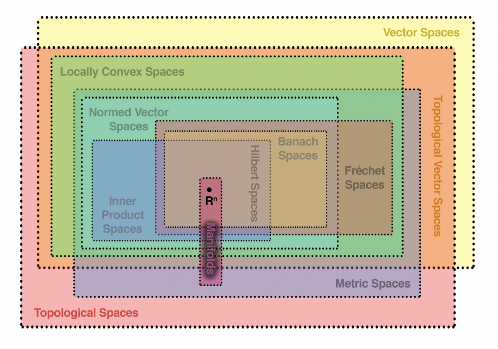
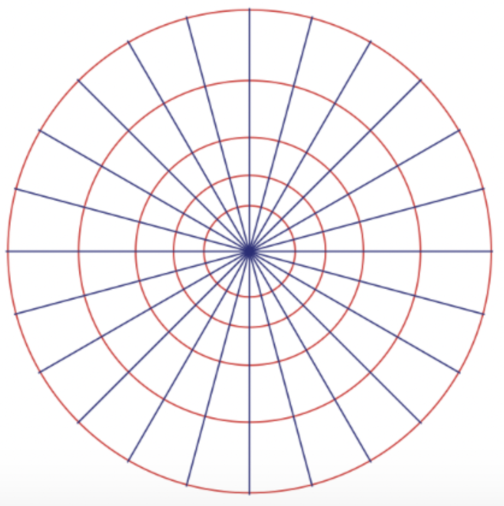

# From Set We Create All

    Kaiwen Bian
    15 min read · Mar 22, 2025

Topology have always seem to be a interesting but puzzling field of study to me. When first introduced to the idea it seems to be highly abstractbut yet rigorous in nature. In this article, I want to goover some of the most fundamental properties of the field of point-set topology and illustarte the point of how it can be served as the most general form of mathematics. All of the ideas in this article is developed from [Allen Hatcher's notes](https://pi.math.cornell.edu/~hatcher/Top/TopNotes.pdf). Point-set topology is defining some of the fundamental properties and bases of mathematics from scratch, which is not usually my strength to discuss about something that is so theoritical with pure math, but I still find it to be extremely facinating and this is why I am writing this article. Paticularly, I want to stress on the **abstract intuitive** and **generative** nature of point-set topology.

  

> Different mathematics spaces from [here](https://math.stackexchange.com/questions/3326615/trying-to-visualize-the-hierarchy-of-mathematical-spaces), illustration of how topology is this bigger wreaparound all spaces.

## Point-set Topology?

Point-set topology aims to develop an intuition about abstract spaces in a general, universal setting. It tries to **define and derive intuitions for abstract spaces broadly**, including real number spaces, probability spaces, and even spaces as general as metric spaces. Unlike traditional geometry, topology defines and explores geometric properties purely from a set theory perspective. **The key is that these geometric properties does not only apply to geometric objects, but rather a space in general**, topology discussses not only about the functions, but the space themselves. This approach makes point-set topology both fundamental and deeply abstract.

The numbers and structures we traditionally use in mathematics, like real numbers, are merely specific instances of how logic can truly be defined mathematically. Similar to programming, topology requires defining a much broader abstract function class to fully encapsulate all possible scenarios.

In essence, the mathematical objects studied in topology, called **topological spaces**, are defined by the rules or operations applied to sets. For instance, the real number space \( \mathbb{R}^n \) is merely a specific example of a more general concept known as a topological space.

There are many facinating concepts in point-set topolgy and this article is not served as a exahustive list, but rather an intuition. I will be discussing mainly about **homeomorphisms** and **basis** to showcase how topology is describing something so general using an method that is rather intuitive. There are so much more inpoint-set topology discussing about connectedness & disconnectedness, cut points, compactness, hausdorff space, infinite product space, quotient space, ect, that are equivalently amazing topics in this field.

## Defining Topological Spaces

I will try to introduce some of the basic concepts in topology to illustarte how amazing it is. A topological space is defined by a set \(X\) together with a collection of subsets called open sets \(\mathcal{O}\), which must satisfy the following conditions:

1. The union of any collection of sets in \(\mathcal{O}\) must be open.
2. The intersection of any finite collection of sets in \(\mathcal{O}\) must also be open.
3. Both the empty set \(\emptyset\) and the entire set \(X\) are open.

Topology can be viewed as qualitative geometry, where two objects are considered **topologically equivalent** (homeomorphic) if one can be continuously deformed into the other without breaking or tearing, this is the classic idea of how a coffee mug is equivalent to a donut. Turns out some of the fundamental rules in calculus have similar representations in topology.

### Being Homeomorphic

We can first try to define being homeomorphic. A fundamental question in topology is: when can two topological spaces be considered the same, even if their physical or geometric properties appear very different?

A **homeomorphism** between two topological spaces \((X, \mathcal{T})\) and \((Y, \mathcal{S})\) is a function:

\[
f: X \rightarrow Y
\]

which satisfies three crucial conditions:

1. Bijective:
    - The function \( f \) must be one-to-one (injective), meaning if \( f(a_1) = f(a_2) \), then \( a_1 = a_2 \).
    - It must be onto (surjective), meaning every element \( b \in Y \) has at least one element \( a \in X \) such that \( f(a) = b \).

2. Continuous:
    - For every open set in \( Y \), its pre-image under \( f \) must be open in \( X \).

3. Inverse is continuous:
    - The inverse function \( f^{-1}: Y \rightarrow X \) must also be continuous. Continuity must be checked both ways.

A homeomorphism ensures the two spaces have the same underlying topological structure, even if their representations or physical appearances differ significantly. Now, consider points in the unit circle \( S^1 \) in \( \mathbb{R}^2 \) described by angles \( \theta \). Polar coordinates establish a homeomorphism from \( S^1 \times (0,\infty) \) onto the plane excluding the origin, \( \mathbb{R}^2 - \{0\} \). Specifically, we define:

\[
f: S^1 \times (0,\infty) \rightarrow \mathbb{R}^2 - \{0\}, \quad f(\theta, r) = (r \cos \theta, r \sin \theta)
\]

This mapping is bijective because every point in the plane (excluding the origin) has unique polar coordinates \( (\theta, r) \). It also takes basis sets of the form \( U \times V \)—where \( U \) is an interval of angles \( (\theta_0, \theta_1) \) and \( V \) is an interval of radii \( (r_0, r_1) \)—to open polar rectangles, which form a basis for the topology on \( \mathbb{R}^2 - \{0\} \).

  

Hence, from a topological perspective, the space of polar coordinates \( S^1 \times (0,\infty) \) is essentially the same as the plane without the origin. This illustrates that changing coordinates or parameterizations is essentially a form of homeomorphism. In general, a homeomorphism maps one topological space onto another in a way that preserves their structural properties, indicating that any reparameterization of a space (like changing from Cartesian to polar coordinates) can be viewed as a homeomorphism.

I find this example to be very interesting exactly because it connects some of the abstract ideas in topology back to what we have learned maybe back in freshman year of college. **To me this is the power of topology describing familier things, the most generic and abstract form, while still maintaining its intuition** (i.e. continuity doesn't need epsilon-delta definition in analysis, we just need it to be a "line" that is connected). I still remanber the first thing that my professor said in our lecture was: "I think the definition given by analysis is not intuitive enough, let's define things more intuitive."

## Generative Nature of Topology

Topology emphasizes finding an origin story or a "key generative set" from which all other subsets and structures of the space can arise. For instance, in \(\mathbb{R}^n\), all open sets can be generated by open balls. Thus, the generative definition, trivial for the case of real numbers, becomes profound when generalized to abstract spaces:

### Basis for a Topology

A **basis** is a fundamental concept in topology, providing a convenient way to define a topology by using simpler, smaller sets known as basis elements. A basis \( \mathcal{B} \) for a topology on a set \( X \) is a collection of open sets satisfying two conditions:

1. Every point in \( X \) is contained in at least one basis element.
2. If a point \( x \) belongs to the intersection of two basis elements \( B_1 \) and \( B_2 \), there must exist a third basis element \( B_3 \) such that:

   $$
   x \in B_3 \subseteq B_1 \cap B_2
   $$

The importance of a basis lies in its ability to generate all open sets of a topology through unions of basis elements (there is another one that uses the intersection, but we are not gonna go into that). For instance, consider the real numbers \( \mathbb{R} \). The collection of all open intervals forms a basis for the standard (Euclidean) topology on \( \mathbb{R} \). Hence, formally, the Euclidean topology basis is defined as:

$$
\mathcal{B} = \{(a,b) \mid a,b \in \mathbb{R}, a < b\}
$$

And that every open set in \( \mathbb{R} \) can be expressed as a union of these open intervals. Now we have the ability to reason about a whole space with a only crucial subpart of it.

### Magical Open Ball

Scaling up, in a **metric space** \( (X,d) \), the concept of a basis emerges naturally from the notion of open balls. Given a metric \( d \), an open ball centered at a point \( a \in X \) with radius \( r > 0 \) is defined as:

$$
B_r(a) = \{ x \in X \mid d(a,x) < r \}
$$

The collection of all such open balls constitutes a basis for the metric space topology:

$$
\mathcal{B} = \{B_r(a) \mid a \in X, r > 0\}
$$

This shows a powerful link between metric spaces and topology: every metric inherently defines a natural topological structure based on open balls, highlighting an important geometric intuition in topology.

### Subspace Topology & Subspace Basis

Given a topological space \( (X, \mathcal{T}) \) and a subset \( Y \subseteq X \), we can define a topology specifically on the subset \( Y \). This induced topology is called the **subspace topology**.

Formally, the subspace topology \( \mathcal{T}_Y \) is defined as:

$$
\mathcal{T}_Y = \{ U \cap Y \mid U \in \mathcal{T} \}
$$

In simpler terms, a set is open in the subspace \( Y \) if and only if it is the intersection of \( Y \) with an open set in the original space \( X \). The idea behind the subspace topology is intuitive: it allows us to "zoom in" and locally examine topological properties within a subset without losing consistency with the broader topological structure.

Consider the example of a circle \( S^1 \) embedded in \( \mathbb{R}^2 \). The subspace topology on \( S^1 \) is generated by intersections of open balls (open sets in \( \mathbb{R}^2 \)) with the circle itself. For example, open arcs on the circle come from the intersection of open balls in \( \mathbb{R}^2 \) with \( S^1 \). Specifically, if we define:

$$
S^1 = \{(x,y) \in \mathbb{R}^2 \mid x^2 + y^2 = 1\}
$$

Then, an open arc on \( S^1 \) such as the following can be expressed as the intersection of \( S^1 \) with an open set (e.g., the first quadrant in \( \mathbb{R}^2 \)).

$$
U = \{(x,y) \in S^1 \mid x > 0, y > 0\}
$$

A **basis for the subspace topology**,or subspace basis (notice that this is not sub-basis, that is a different topic) on \( Y \subseteq X \) is similarly derived from the basis of the larger space \( X \). If \( \mathcal{B} \) is a basis for topology \( \mathcal{T} \) on \( X \), then the set:

$$
\mathcal{B}_Y = \{ B \cap Y \mid B \in \mathcal{B} \}
$$

forms a basis for the subspace topology on \( Y \). For example, the Euclidean basis for \( \mathbb{R}^2 \) generates a basis for any line or curve within the plane, simply by intersecting these open sets with the subspace.

This interplay between bases and subspaces provides a powerful method to systematically analyze topological properties within subsets, demonstrating topology’s deep structural versatility.