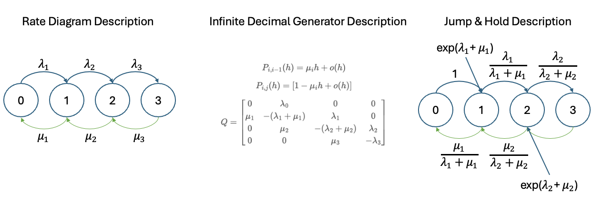

  <h1>Unfolding Stochasticity Sequentially</h1>
  

    
    

      Kaiwen Bian
      10 min read · Jun 12, 2024
    

  

  <h2>Setting Bases of Sequential Process In Nature</h2>

    

<blockquote>
    
Random Walk: Key Example

  </blockquote>

  

      Stochastic processes is abut understanding from <strong>local to gloabl</strong>, by having single transition probability matrix (discrete) or transition probability function (continuous) and trying to understand 
      some global behavior of such chain or processes (i.e. absorption time, expected time of termination, or stationary distribution). WHat I found stochastic processing to be really amazing is how it is trying to <strong>model 
      how randomness and stochasticity may play out in nature</strong>, and not at one time stamp but rather across different time stamp sequentially. It try to reason and capture some details about the nature, <strong>to undertsand a chain of 
      "randomness" seuqntiall</strong> (not so random when you cna model it). Compare to random variables that reasons about how "randomness" plays out at one time stamp, stochatsic processes may dive into the interactions between "randomness" across time, to 
      dive into their interactions, seeing how they sequentially interact and the prior effect the laters (of course under markov property only one layer of looking backward is needed).
  

  

      In this section I want to discuss (not techniqually) about how amazing this field may be with one classic example that bridges across discrete Markove Chains (MC), Continuous Time Markov Chains (CTMC) and COntinuous Time Continuous State Brownian Motion (BM): <strong>Random Walk (RW)</strong>.
  

  
  <a href="../../../assets/math/stochastic_process_notes.jpg" target="_blank">
    
&#9881; Some Notes on Stochastic Processes

    </a>
  
  
Some extension with more techniqual details on the three interpretations of Continuous Time Stochastic Processes.

  
  <a href="../../../assets/math/stochastic_process_details.jpg" target="_blank">
        
&#9881; More Techniqual Details

    </a>

  <h2>Markov Chain: Analysis Into Stochaticity</h2>
  

      When considering about a sequential process that have "randomness' depending on teh previous "randomness", onemust consider using ideas from conditional probability, which discusses about a distribution given that a different distribution has occured. No matter MC, CTMC, or BM, they all hold/are established on 
      a very powerful property known as the <strong>Markov Property</strong> that makes many of the techniqual details working with conditional probability much easier. Mathamatically:
      $$
      P(X_n = x | X_{n-1} = x_{n-1}, \dots, X_0 = x_0) = P(X_n = x | X_{n-1} = x_{n-1})
      $$

      $$
      P(X_{n+1} = x_{n+1} | X_n = x_n) = P(X_{n+1} = x_{n+1} | X_n = x_n, \dots, X_0 = x_0)
      $$
      Saying that the "current" \(X_n\) does not depends on distance past but rather only the nearest past \(X_{n-1}\) and that the "future" \(X_{n+1}\) does not depend on the past but only the "present" \(X_n\).
  

  

      With Markov Property holding, mathamatician can reason with the chain or such sequential process much more easily and some <strong>global probability</strong> such as expected time of termination, return probability, stationary distribution can be analytically calculated. One key theme in stochastic processes is that one might 
      want to setup an recureent (recursive) system to reason about how things unfold, then finding  generalized pattern (explicit solution) from such system of equation. Remanber that a recurrence system is equivalently represented in linear algebra as a system of equation when flatening all of it out, then numerical optimization can 
      also be conducted. Taking an example of the return probability:
      $$
      u_{ik} = P_{ik} + \sum_{j=0}^{k-1} P_{ij} u_{jk} = P(X_{T} = k | X_0 = i)
      $$
      which talks about teh probability of terminating the chain at point \(k\) given that it starts on point \(i\). Equivalently, it can be written in matrix format for numerical optimization:
      $$
      u^{(k)} = (I - Q)^{-1} R^{(k)}
      $$
      Same idea can be used to reaosn with expected time of termination:
      $$
      E[T | X_0 = i] = 1 + \sum_{j=0}^{r-1} P_{ij} \omega_j = \omega_j
      $$
      These types of reaosnings are known to be <strong>First Step Analysis</strong> and it is one of the mos commonly used idea to reason with a sequential event in stochastic processing.
  

  

      To the core example that I want to cover in this section: Random Walk (RW). RW in the discrete state + discrete time condition is essentially a Markov Chain with the transition probability matrix:
      $$
      \Pr(X_{n+1} = j | X_n = i) = 
      \begin{cases} 
      q_i & \text{if } j = i-1 \\
      r_i & \text{if } j = i \\
      p_i & \text{if } j = i+1
      \end{cases}
      $$
      under the constrained that \(q_i + r_i + p_i = 1\).
  

  

      Knowing that this is a Markov Chain and its transition probability matrix, much can be conducted and all of the analysis that was mentioned earlier can be used to help finding a global state of the chain. It 
      is worth notice that though vanilla RW is only in discrete state + discrete time condition, it is actually a core example taht can be carried over to more complicated situations. Even under discrete condition, 
      it can serev a pretty fine model for stochastic modeling in some practical senerios. For instance, gamble's ruin modeling or modeling stochasticity to see if learning has occured.
  

  <h2>Continuous Time Markov Chain: Discretize + Functional Analysis</h2>
  

      Now this is where tings gets a lot more complicated because CTMC is trying to reason under the condition that time is continuous, which introduces many more deficulties mathamaticaly. Remenber that we said one core idea in stochastic processes is to setup a recurence system and 
      try to solve such system? When state is discrete, we can count them as steps and do recursion in that fashion, but when states are continuous, recursion can still be conducted, but sometimes with differential equation, which is not something that w  want to do, the complexity is very high. 
      When studying more into CTMC, one may encounter many classic processes that are CTMC, namely most of the classic examples deals with reasoning "when customer come into and leave a store":
      <ul>
          <li>
              

                  Poisson Process (PP): constant \(\lambda\) (rate), random time, unidirectional jump
              

          </li>
          <li>
              

                  Pure Birth Process (PBP): dynamic \(\lambda\) (rate), random time, unidirectional jump
              

          </li>
          <li>
              

                  Birth and Death Process (BDP): dynamic \(\lambda\) (rate), random time, random jump
              

          </li>
      </ul>
      These process in nature are easier to be described by <strong>rate diagram</strong>, which is how they are defined (rate diagram description is one of the three ways to interpret an CTMC) and we can use random variables to monitor such process or deducing transition probability function (i.e. increments of an 
      Poisson Process follows Poison distribution random variable). <strong>Maybe in some sense, these random variavbles may be a good abstraction to represent the process just like how weights can be used as a representation of a predictive function? (ideas in Jump & Hold description?)</strong>
  

  

      Problem with description comes where it becomes kind of hard trying to find some global property when reasoning under this paradigm. Thus, we can extend to the second and third interpretation of an CTMC: <strong>Jump & Hold Description</strong> and <strong>Infinite Decimal Generator Decription</strong>. This is where things really gets complicated 
      because the first need to project an contnious chain to an discrete chain by discretize the continuous scale into a discrete numbers of continuous random variable depending on teh process in interest and the second is invlolved in using Functional Analysis techniques and theorems to find an <strong>Q Matrix</strong> that captures time dependent information 
      while being itself a time independent matrix (hence the name genertaor). Here is a few names that might be worth looking into:
      <ul>
          <li>
              
<strong>Semigroup Property & Hille-Yoshida Theorem</strong>: Functional Analysis aspects of stochastic processes that's the bases of the Infinite Decimal Generator Description, creating the Q matrix for generating transition probability functions.

          </li>
          <li>
              
<strong>Kolmogorov Forward/Backward Equation</strong>: Turning transition probability function into a system of differential equation, also connecting to dieas later on in Brownian Motion using  as set of differential equation to monitor a system.

          </li>
      </ul>
  

  

      
    

    <blockquote>
        
Different Description of Continuous Time Markov Chain

    </blockquote>

  

      However, though being extremely complex, when dive into the analysis, it has a deep connection back with random walk, but just under a much complicated condition.
  

  <h2>Brownian Motion: Bridging Analyst & Probabilist</h2>
  

      Moving to Brownain motion, this is modeling stochasticity under continuous time and continuous state, which has a very deep theoritical root connecting back to the Analysis aspects of mathamatics. This is also where the quote I put on the left comes from where equality equation refers to the Analysis aspects of mathamatics and inequality equation refers to the modeling aspects of mathamatics. 
  

  <blockquote>
      
Inspired by Prof.Carfagnini: "In math you either deal with equality equation or inequality equation, but sometimes they bridge"

  </blockquote>
  

      Essentially in Brownian Motion, wes ay that modeling a system of differentiual equation to know everything about how heat dissapate in a region is the eqivalent with deploying a stochaastic agent into the environment, let it play around and see how the probabilistic rollout would be to map out the boundary condition (analyst's approach v.s. a probabilist's approach). And, again, when looking it from 
      certain angle, the connection to Random Walk als shows up again.
  

