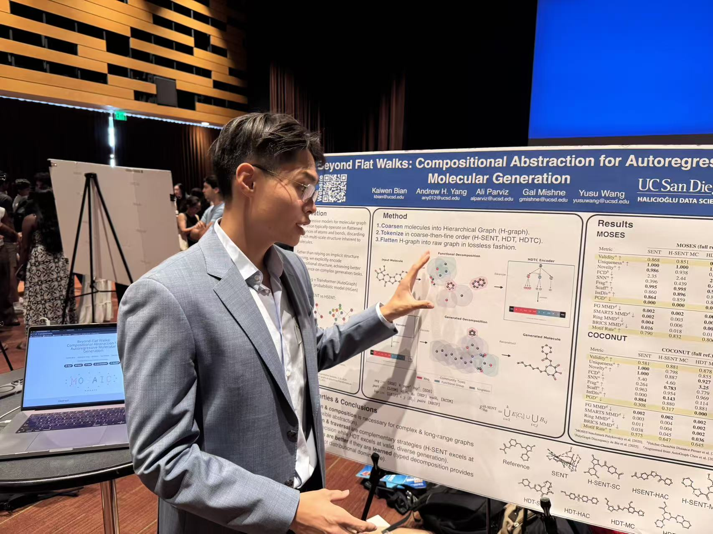

  

    
    

      Kaiwen Bian
      20 min read · Mar 16, 2026
    

  

In March 2016, AlphaGo defeated Lee Sedol --- one of the greatest Go players in history --- in a 4--1 match that stunned the world. The narrative everyone tells is about deep reinforcement learning and neural networks. But the secret weapon that really made it work was a much older, more elegant idea: the **Upper Confidence Bound**. Before AlphaGo could use neural networks to evaluate board positions, it needed a principled way to decide which moves to even *consider* --- how to balance exploring new, untested moves versus exploiting moves already known to be strong. This is the **multi-armed bandit problem**, and UCB is the provably optimal solution. The math behind it is surprisingly beautiful, and the intuition extends far beyond slot machines and board games.

## The Multi-Armed Bandit Problem

You're in a casino with \(K\) slot machines (the "arms"). Each machine has an unknown payout distribution with mean \(\mu_i\). You have \(T\) rounds to play. At each round, you pick one machine, pull its arm, and receive a random reward. Your goal: **maximize your total reward** --- or equivalently, **minimize your regret** from not always playing the best machine.

Here's a concrete version. You have two unfair coins with unknown means \(\mu_1\) and \(\mu_2\). At each round, you pick a coin to bet on; it lands heads with its unknown probability, and your payoff is in \([0, 1]\). You're making sequential bets, and the challenge is that you don't know which coin is better. Every time you play the worse coin, you lose expected value compared to someone who knew the answer from the start.

This has the structure of an **expectimax tree**: at each step you choose an action (which coin), then nature reveals a stochastic outcome. The twist is that the distribution parameters are unknown, so you can't just compute the optimal policy --- you have to *learn* it while playing.

The bandit setting appears everywhere: clinical trials (which treatment to assign), ad placement (which ad to show), recommendation systems (which content to suggest), and hyperparameter tuning (which configuration to try). Any time you must make sequential decisions under uncertainty with limited feedback, you're facing a bandit problem.

## Regret --- The Cost of Not Knowing

To measure how well a strategy \(\sigma\) performs, we define **regret** --- the expected loss compared to an oracle that always plays the best arm:

$$
R_\sigma(t) = \mathbb{E}_{c_i \sim \sigma}\left[\mu^* t - \sum_{i=1}^{t} \mu(c_i)\right]
$$

where \(\mu^* = \max_i \mu_i\) is the mean of the best arm, and \(c_i\) is the arm chosen at round \(i\) by strategy \(\sigma\).

Think about the extremes:

- **Always wrong** (always play the worst arm): regret grows linearly with slope \(\mu_1 - \mu_2\). This is the worst case --- linear regret, \(\Theta(t)\).
- **Always right** (always play the best arm): zero regret. But this requires knowing the answer in advance.
- **Uniformly random** (flip a fair coin to decide): linear regret with slope \((\mu_1 - \mu_2)/2\). Still linear --- still bad.

The fundamental question: **can we achieve sublinear regret?** Can we design a strategy that, over time, loses less and less per round compared to the oracle? The answer is yes, and the best possible rate is \(O(\log t)\).

## Simple Strategies and Their Limits

### Explore-Then-Commit

The most natural idea: spend the first \(N\) rounds exploring (play each coin \(N\) times to estimate its mean), then commit to whichever looks better for the remaining \(T - 2N\) rounds.

This works, but the regret is:

$$
R(T) = O\left(T^{2/3}(\log T)^{1/3}\right)
$$

with the optimal choice of \(N\). The problem is a fundamental tension: if \(N\) is too large, you waste exploitation time on exploration you didn't need; if \(N\) is too small, your estimates are noisy and you might commit to the wrong arm. You have to decide *in advance* how much to explore, with no way to adapt.

### Epsilon-Greedy

A more adaptive idea: at each round, with probability \(1 - \varepsilon\) play the arm with the best empirical mean (exploit), and with probability \(\varepsilon\) play the other arm uniformly at random (explore).

With the optimal decaying schedule \(\varepsilon = c \cdot t^{-1/3}(\log t)^{1/3}\), the regret is:

$$
R(T) = O\left(T^{2/3}(\log T)^{1/3}\right)
$$

The same \(O(T^{2/3})\) rate. Epsilon-greedy is more adaptive than explore-then-commit, but it still explores *blindly* --- it doesn't use what it knows about each arm's uncertainty to guide exploration. We can do much better.

## Concentration Bounds --- The Key Insight

The breakthrough comes from **Hoeffding's inequality**, which tells us exactly how concentrated sample means are around true means:

$$
P\left(|\bar{X} - \mu| \geq \varepsilon\right) \leq 2e^{-2N\varepsilon^2}
$$

where \(\bar{X}\) is the sample mean of \(N\) i.i.d. observations from a distribution with mean \(\mu\) and support in \([0, 1]\).

The more samples you have, the tighter the concentration. Setting the confidence radius to:

$$
\varepsilon = \sqrt{\frac{c \log T}{N}}
$$

gives:

$$
P\left(|\bar{X} - \mu| \geq \varepsilon\right) \leq \frac{2}{T^{2c}}
$$

This is incredibly powerful. With high probability (at least \(1 - 2/T^{2c}\)), the sample mean is within \(\varepsilon\) of the true mean. And \(\varepsilon\) shrinks as \(\sqrt{1/N}\) --- the more you sample an arm, the more precisely you know its value. This is what makes UCB possible: we can *quantify* our uncertainty about each arm and use it to make intelligent exploration decisions.

## The Upper Confidence Bound

UCB combines exploitation and exploration into a single elegant formula. For each arm \(i\) at time \(t\), compute:

$$
B(i, t, n_i(t)) = \bar{X}_i + \sqrt{\frac{2\log t}{n_i(t)}}
$$

where \(\bar{X}_i\) is the empirical mean reward of arm \(i\) and \(n_i(t)\) is the number of times arm \(i\) has been played up to time \(t\). Then **play the arm with the largest** \(B\).

The formula has two terms:

- **First term** \(\bar{X}_i\): **exploitation**. Favor arms with high observed rewards.
- **Second term** \(\sqrt{2\log t / n_i(t)}\): **exploration bonus**. Favor arms that have been played less (large when \(n_i\) is small relative to \(t\)).

In the first \(K\) rounds, every arm has \(n_i = 0\), so the exploration term is \(\infty\) --- every arm gets tried at least once. After that, the exploration bonus naturally decays for well-sampled arms while remaining large for underexplored ones. UCB is **optimistic in the face of uncertainty**: it assumes each arm is as good as it could plausibly be, given the data so far.

### The Regret Theorem

**Theorem** (Auer et al., 2002). Under UCB, each suboptimal arm \(i\) (with gap \(\Delta_i = \mu^* - \mu_i > 0\)) is played at most:

$$
\mathbb{E}[n_i(t)] \leq \frac{8\log t}{\Delta_i^2} + O(1)
$$

times. Suboptimal arms are played *logarithmically* often --- exponentially less than linear. The overall regret bound is:

$$
R_{\text{UCB}}(t) = \sum_{i=1}^{K} \Delta_i \cdot \mathbb{E}[n_i(t)] \leq \sum_{i=1}^{K} \frac{8\log t}{\Delta_i} + O(1)
$$

This is \(O(\log t)\) --- **dramatically better** than the \(O(T^{2/3})\) regret of explore-then-commit and epsilon-greedy. Moreover, Lai and Robbins (1985) proved that \(O(\log t)\) is the *best possible* rate for any consistent strategy, so UCB is **order-optimal**.

The key intuition: UCB doesn't waste exploration. It explores arms *precisely as much as needed* to be confident about their quality, then naturally shifts to exploitation. Arms that are clearly bad get abandoned quickly (small \(\Delta_i\) means more exploration is needed, but the penalty per play is also small). The balance is automatic --- no tuning of exploration parameters required.

## From Bandits to Trees --- MCTS and UCT

The bandit problem assumes no sequential structure --- each arm is independent, and pulling one arm tells you nothing about the others. But in games like Go, choices form a **tree**: your move determines the opponent's options, which determine your future options, and so on. How do we apply bandit ideas here?

**Monte Carlo Tree Search (MCTS)** builds a search tree incrementally using four steps:

1. **Selection**: Starting from the root, traverse the tree by choosing children until you reach a leaf node. At each internal node, the choice of which child to visit is a multi-armed bandit problem.
2. **Expansion**: Add one or more children to the leaf node.
3. **Simulation** (rollout): From the new node, play randomly until the game ends to get an outcome.
4. **Backpropagation**: Update the win/visit statistics for all nodes on the path from root to leaf.

The key insight is that step 1 --- choosing which child to explore at each node --- is *exactly* a multi-armed bandit problem. Each child is an "arm," the simulation outcomes are the "rewards," and we need to balance exploring less-visited children versus exploiting children with high win rates.

**UCT** (UCB applied to Trees) uses the UCB formula at each node. The BestChild selection is:

$$
\text{argmax}_{s' \in \text{children}(s)} \left(\frac{Q(s')}{N(s')} + c\sqrt{\frac{2\ln N(s)}{N(s')}}\right)
$$

where \(Q(s')\) is the total reward through child \(s'\), \(N(s')\) is the visit count of child \(s'\), and \(N(s)\) is the visit count of the parent. The first term \(Q(s')/N(s')\) is exploitation (average win rate), and the second term \(c\sqrt{2\ln N(s)/N(s')}\) is the exploration bonus (try less-visited nodes). The constant \(c\) controls the exploration-exploitation trade-off.

UCT inherits UCB's theoretical guarantees: it converges to the optimal move as the number of simulations grows, and it does so efficiently by focusing search on the most promising parts of the tree.

## AlphaGo --- UCB Meets Deep Learning

AlphaGo (Silver et al., 2016) combined MCTS+UCT with deep neural networks to achieve superhuman Go play. The architecture has three components:

- **Policy network**: A deep CNN trained on 30 million positions from human expert games, predicting the probability of each move. Achieves 57% accuracy at predicting expert moves --- for a game with ~250 legal moves per position.
- **Value network**: A deep CNN trained via self-play reinforcement learning, predicting the probability of winning from any board position. This replaces the random rollouts in vanilla MCTS with learned evaluation.
- **MCTS+UCT**: The search algorithm that ties everything together. The policy network guides which moves to expand (prior probabilities in the tree), and the value network evaluates leaf positions.

The UCB exploration bonus is what makes this work as more than just "play the neural network's top suggestion." Without exploration, AlphaGo would be limited by the biases in its training data --- it would only play moves that human experts played. The exploration term ensures that uncertain but potentially strong moves get investigated. This is precisely why AlphaGo made "creative" moves that surprised human experts --- moves like Move 37 in Game 2 against Lee Sedol, which no human would have played but turned out to be brilliant. The UCB principle said: "this move is uncertain, so it might be great --- let's find out."

The combination is greater than its parts. MCTS provides structured search. Neural networks provide learned intuition. UCB provides the principled exploration that connects them. Remove any one component and the system fails.

## UCB and Life --- Choosing the Uncertain Path

In life, we face bandit problems constantly. Which career path to pursue? Which city to live in? Which skill to invest in? Which relationship to nurture? At every fork, we're trading off exploiting what we know works against exploring something new that might be better --- or worse.

The UCB principle offers a mathematically grounded philosophy: **when you know very little about an option, its exploration bonus is huge --- you should try it.** Only when you've gathered enough information should you commit to exploiting the best known option. The formula literally says that the value of trying something is highest when your uncertainty about it is greatest.

The mathematically optimal strategy for minimizing regret is *not* to always play it safe with what you know. It's to be **optimistic in the face of uncertainty** --- to choose the uncertain path precisely *because* you haven't explored it enough. The regret from never trying something is worse than the regret from trying and learning it's not for you. One gives you information; the other gives you nothing but the nagging question of "what if?"

UCB tells us: the less you know about something, the more reason you have to try it. And the beautiful part is that this isn't just feel-good advice dressed up in math --- it's the *provably optimal* strategy. The universe rewards the curious.

## References

- Sicun Gao, CSE 257, UCSD --- Bandits and MCTS lecture slides
- [UCB derivation notes](../../../assets/math/ucb.pdf)
- [UCB example walkthrough](../../../assets/math/ucb_example.pdf)

1. Auer, P., Cesa-Bianchi, N., & Fischer, P. **Finite-time Analysis of the Multiarmed Bandit Problem.** *Machine Learning*, 2002.
2. Silver, D., et al. **Mastering the game of Go with deep neural networks and tree search.** *Nature*, 2016.
3. Kocsis, L. & Szepesvari, C. **Bandit based Monte-Carlo Planning.** *ECML*, 2006.
4. Lai, T.L. & Robbins, H. **Asymptotically efficient adaptive allocation rules.** *Advances in Applied Mathematics*, 1985.
