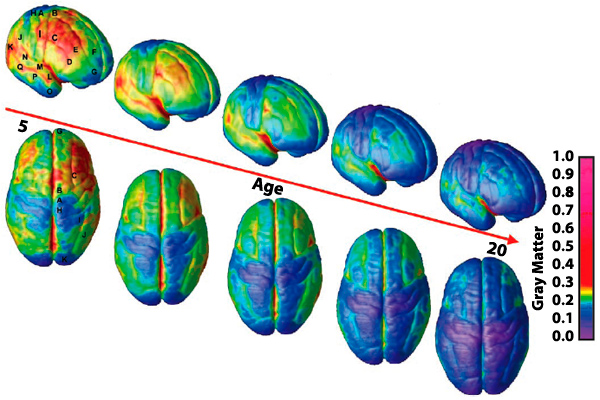

# What We Think Deternmines What We Can Think

  
  

    Kaiwen Bian
    10 min read · Aug 20, 2024
    Modified on Feb 21, 2025
  

I think that one can not go to all the abstract realm of the mind without grounding in a biological system. In the same time, it becomes very hard to connect biology to our perceptual expereiences and what we feel everyday without the support of these abstract concepts**. They have the mutual relationship where thoughts develops the neurological foundations within our brain and later such system we developed effects how we think and feel** (i.e. the formation of habits is a great demostration of Hebian plasticity and such system formation).

  

I have always been facinated about how our ideas and thoughts may be shaped by the biological circuit behind it, discussing abstract ideas in psycology, but grounded in biology. I believe that with understanding of psycology and neuroscience, we can make better decisions and reach closer to where we want to be at. To some degree, **just like practicing muscles, we want to develop a neuronal system that is strong and suitable for what we want**. First we will go over a perspective in **developmental neurobiology**, then dive more into how we can guide ourselves better with **positive psycology**, and at last attempt to connect them.

*The ideas discussed here are drawn mainly from professor Kaiping Peng's lectures in hundun-academy and from professor Andrea Chiba's Cogs 164 lectures in UCSD.

## Psycological <-> Neurological Development

Let's first discuss this from a developmental neurobiology perspective, specifically through looking at the period of being a teenager. Teenager period is the most susceptiable period to impulse-control disorder, substance-use disorder, anxiety disorde, mood disorder, or even Schizophrenia. As what professor Andrea Chiba described in her lecture:

> "This is a period of extreme vulnerability, but with such vulnerability, there raises plasticity and hopes."

This is the period when there are **vast perturbing** to the system, **vast plasticity** that can both take you to the top of the moutain as well as the bottom of a big hole. With the **physical development** that we get to our brain, we need sufficient **psycological development** to maintain the stability of the system while perturbing it for "thining" the cortical layers (less connections but stronger connections, prunning on the grey matters, more quicker and efficient connections). The Pre Frontal Cortex (PFC) continue to develop way surpass teenager period, so one is essentially constructing up their own PFC with the experiences they have and the perception they have on these experiences: "psycology guides neurological development and neurological determines where psycological development can even go towards".

  

According to the **Self-Deternmination theory**, psycological growth can only be acheived when the followig are achieved (*note that each of the following section may be its own filed in psycology, this is just a brief description):

- **Autonomy**: One need to feel in control of their own behaviors and goals. This sense of being able to take direct action that will result in real change plays a major parf in helping people feel self-determined and finding their sense of **self**.

- **Competence**: One need to gain mastery of tasks and learn different skills. When people feel that they have the skils needed for success, they are more likely to take actions that will help them achieve their goals. This sense of behaviors driven by **intrinsic reward** is what makes them feel **in control**.

- **Connection or relatedness**: One need to experience a sense of belonging and attachment to other people.

When any of these fails, it becomes hard for one to **feel in control** of the situation and may trigger un-favoriable adapattion towards teh wrong circuit.

## How You Feel Towards Distal Stimulus

Evolution doesn't pick the strongest or the smartest species, but rather those that adapt to changes and cooperate most effectively. It is crucial for us to have the ability to manage our internal state and adapt to fit what 
the environment need. This is the same as "state flexability" in the context of Allostasis (discussed in the other article). In positive psycology research, people have found these 3 characteristics to be key of adaptation.

- **Resilience:** The capacity to recover quickly, the ability to constantly rise again.
- **Grit:** The ability to endure and persist, the ability to be tenacious.
- **PTGD:** The ability to not only survive but thrive after experiencing hardships and challenges, to strive post-traumatic growth and development.

I think that there are three (two emphasizing on the abstract level and one on the biological detailed level) core aspects (Self Efficacy, Growth Mindset, and Building Neuronal Circuits) that can give an good example of how **what we think effects what we do and what we can think later.** We don't want to not fail negativity, but rather how to think of it and react towards it through strong **self-efficacy** and **growth mindset**.

### Faith in yourself: self-efficacy

Self-efficacy is the faith that you give to youyrself, which is crucial to the ability to withstand pressure. It is about believeing that you can and you have the ability to succeed. With high self-efficacy, stress and challenges are opportunities to prove yourself. Though self-efficacy is a higher-level abstraction idea, we can use other abstractions to trigger neruonal adaptations, namely:

- **Fake it until make it**: When thoughts becomes action repeatidly, it becomes a habit, then habits becomes more actions, repeated wise.

- **Vicarious success**: When being accepted by people you want to be, it becomes easier to be these people.

- **Unexpected social support**: Evolution favors cooperators (the strong effect of weak ties). Opportunities are usually brought by people that you wouldn't expect.

- **Simulated practice**: One of the greatest power of the human brain is our predictive ability. Our brain can envision the future or jump around dimensions neglecting the effect of time. When the brain is under the **default mode/circuit** (a mode when you are not exactly thinking about anything and just being "board", i.e., during shower), it constantly makes predictions, processes emotions, conduct introspects, at a level beneath cognition. With such ability, we can escape the realm of "reality" to travel in much more abstract space.
    - We can conduct "visualization", to mentally imagine success. The more you envision, the clearer the intention (mirror cell effect as well).
    - Instead of focusing on details, see the bigger picture, the global properties.

### Avoiding the burden of excellence: growth mindset

A growth mindset, as contast to a stationary mindset, is a belief believing that only attitude and effort determine what can be learned, where risks and challenges are enjoyed and self-feedback/suggestions determines outcomes. Th greatest hinders to a grwoth mindset is **The burden of excellence** where people believe in that they "should be something" instead of they "could be something". This can can lead to negative feelings (below the standard line), while "earned through effort" provides positive feelings. A growth mindset believes that there is no “should,” no “should be good at learning” or “should be smart,” risks and challenges bring new outcomes.

- **Process-oriented**: Self-assessment standards should be process-oriented, not outcome-oriented, R&D is about challenges and risks (Success should be measured by changes, just as dopamine does). Instead of saying that an event is "impossible to achieve", frame it as "not yet", or "maybe try more later".

- **Telling of the story makes the story**: The stories we weave causes physical and mental reactions that we felt
    - Activating event -> Belief -> Consequences: A cannot be changed, but B can, hence C changes. Use the prefrontal cortex to refute B's thoughts.
    - Remanber that the failing to acknowledge negative aspects means missing out on positive experiences; the two are interconnected. One cannot achieve positivity without ubnderstadning negativity.

## Thoughts <-> Biological Circuits
In cognitive science, a well adopted perspective is the following:

> "It is not the distal stimulus itself that matters, but rather the nueronal activation that give us perception".

It is the perspective and the interpretation of the distal stimulus that matters, it is the attitude that determines the actions and the reality. A positive cognition would deliver a physical and mental state that is full of vitality and makes it easier to see the goodness in humanity. However, it is impossible to not feel negative emotions. Hinders of feeling negativity causes unhealthy connections between Amygdala and PFC, causing potential development of being a psycopath. With that being said, we can use our understanding of neuroscience to navigate what we can do when negative feeling strikes, the key is always to **adapt to changes that the environment poses and regulate our internal feeings/mental state, what we think effects the biolgical mechanism of the brain and such system effects how we think**.

- **Physical cooling**: The amygdala is located behind the nose and its activation represents congestion with temperature rises. When inhaling cool air, we physically cool down the amygdala and lowers its activations.

- **Celebrate success**: Prolong the time of happiness, after four minutes, memory conslolidates and the physiological pleasure neural network is formed (remember, later watching is equivalent to doing in the eyes of neuronal mechanisms).

- **Neurologically "proactive"**: Use positive neurotransmitters to form positive neuro-emotional networks. Psychological activity isn't a single point, but an interconnected area. Quoting from professor Andrea Chiba, **sometimes it is not the "regions" that went wrong but the lack of myolination that caused insufficient information sent**.
    - Dopamine: Released when helping others, discovering self-strengths, experiencing self-worth, doing what others cannot.
    - Serotonin: Released when protecting self-esteem or basking in the sun.
    - Endorphins: Happiness from deeper thinking or delayed gratifications.
    - Oxytocin: Giving feel of love. released by warm hugs, receiving and giving compliments, or engaging in empathetic, understanding, appreciative, and supportive conversations.

- **Habitual behaviors**: Humans easily fall into habitual behavior, to act automatically without thinking. When challenges arise, habits become instincts, and instincts serve as an important protective mechanism.

- **Build default immersive circuits**: Find your own Flow and immerse in it to experience deep engagement. With such an system build and reinforced by Basal Ganglia, doing more of it is much easier.

<!-- > "沉浸其中，物我两忘，酣畅凌厉，如痴如醉" -->

## Evolution of a Desirable Circuits
Building a circuit against stress is a **process caused by evolution**, we are keep trying to construct better and better neuronal systems. We need to use all possible methods at hand to build a desirable neuronal cuirtuit during moment of stress to react to it at the moment and also build foundations for later reactions. With more of such response, habitual circuits would be formed and reaction to stress or challenges later would be as simple as instinct.

Matching on the thoughts levels than reality will follow. Think about the person that you want to be, imagine what this person would do and do it, act like him/her and align your thinking on an abstract level first. Every single little small thing that you do like this person would prove a bit mroe that you are this person. As the bricks lays and as time goes on, you become this person.