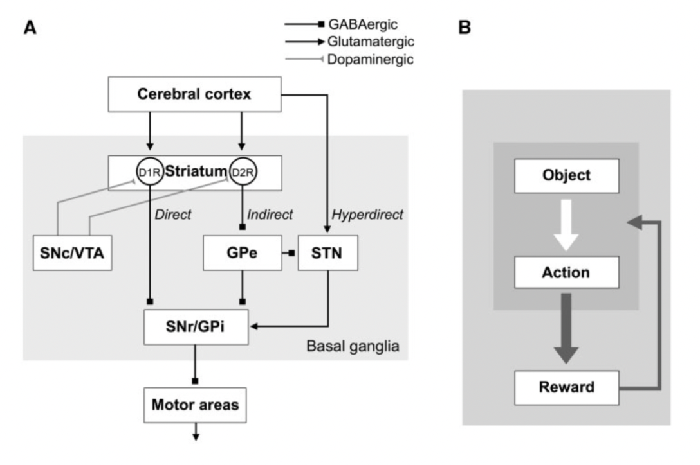
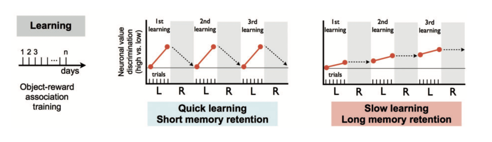
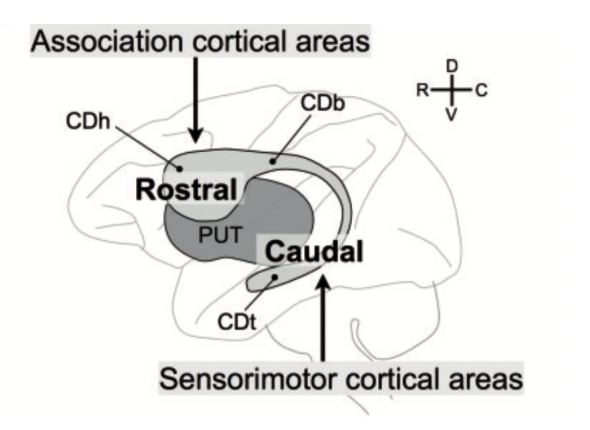
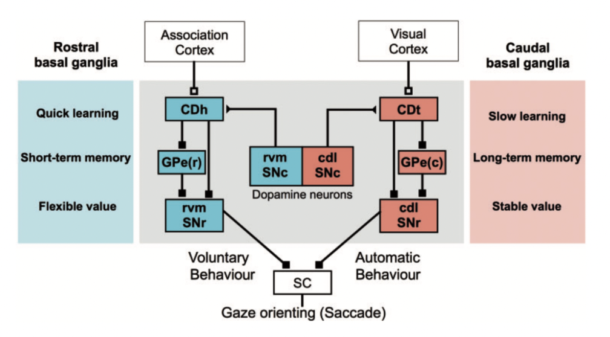

  

    
    

      Kaiwen Bian
      5 min read · Jun 14, 2024
    

  

  

    Biological system has always been used as inspirations for artificial networks that boosted learning. Upon all of them, I find Basal Ganglia to be the most facinating as it seems to resemble some "nature" of 
    information processing and finding the true structure that stems "intelligence" in nature.
  

## Basal Ganglia Structure

  

    Basal Ganglia can be deemed as a “reinforcing unit" that is highly connected to many of the other functional circuit in the brain and it is strongly modulated by the expectation of reward.
    As a theme in neuroscience, "generally speaking, we learn changes in the world", the errors \(\delta\) from expectation is what governs the neuromodulation system (dopamine ) in the Ventral Tagmental Area (VTA), which 
    have dense projections on the Striatum that encodes sensory motor information (via direct pathway D1 and indirect pathway D2).
  

  

    When reward is expected, the D1 direct pathway would be mroe active with D2 indirect pathway less active (reward association is captured: one facilitate reward prediction and one facilitate non-reward prediction). To be more 
    specific, the direct pathway would have inhibition from the Striatum to the GPi that inhibits the Thalamus. Thus, such inhibition of the inhibition would cause the Thalamus to be more active, creating positive reinforcing. On the 
    other hand, the indirect pathwat excite the GPe that inhibits the STN that excites the Thalamus. Thus, such excitation of the inhibition on the inhibition would cause the Thalamus to be less active, creating negative reinforcing. 
  

  

    
  

  <blockquote>
      
Basal Ganglia (Kim, Hyoung F., and Okihide Hikosaka (2015))

  </blockquote>

## Search & Manipulate Valuable Objects

  
The goal is always to maximize the reward, which can be separate into two problems, <strong>one being finding valueable objects in the environments with sensory input (exploration)</strong> and the <strong>other being manipulating such valuabel object to retain reward (exploitation)</strong>. To reach 
    the reward, it is always a brain-wise effort because all attention, motivation, context, uncertainty measurement, risk assessment, ... need to be performed, in here we just particularly examine Basal Ganglia.
  

  

    Dopamine signals is what biases sensorimotor inputs, but how should it balance between the exploration adn exploitation? In algorithm research, that is always a question that puzzles researchers, but seems like the brain have its own answer. The blue (CDh-rvmSNr) circuit is inherently recieving projection that makes 
    <strong>quick learning + short memory retention</strong> while the red (CDt-cdlSNr) circuit is <strong>slow learning + long memory retention</strong>. In another words, the blue circuit is very sensitive to immediate reward (boost learning) while the red circuit is more proned to using stable-value-objects.
  

  

    Not talking about algorithm but just as a discussion about life, this is a neuroscience argument of why you should persue the things you are interested in the moment you find them interested
  

  

    
  

  <blockquote>
      
Exploration/Exploitation (Kim, Hyoung F., and Okihide Hikosaka (2015))

  </blockquote>

## Parallel Processing

  

    From a more macro perspective, Basal Ganglia recieves multiple input from multiple areas at once. Both limbic/higher control (association cortical areas) and sensory information (somatosensory cortex) reaches the Striatum in the same time. The 
    true amazing aspect of Basal Ganglia is that no convergence is really needed, the topographic input is preserved in the same format when outputted. It can work independently on several streams of information from different orders of levels.
  

  

    
  

  <blockquote>
      
Projection to Basal Ganglia (Kim, Hyoung F., and Okihide Hikosaka (2015))

  </blockquote>

  

    In a familier environment with familier objects (stable-value-objects), the objects should have well-predicetd valeus as they have been seen many times (mental representation is well defined): red (CDt-cdlSNr) circuit is active with blue (CDh-rvmSNr) circuit providing less bias. This setup can be seen 
    as an <strong>exploitation stage</strong> if putting under the framework of algorithm, it is maximizing the reward from previously known values. On teh other hand, if the envioronment is unfamilier (flexiable-objects), we can "pick some object adn check their values", refering to 
    the <strong>exploration stage</strong>. Overtime as more are explored, these known "well-known value objects" becomes stable-value-objects (I kind of interpret it as <strong>frozen neurons</strong>).
  

  

    That was describing one object, but in the real environment it is always multiple objects happening at thes ame time, some flexiable-object and some stable-value-objects, parralel processing comes in and the circuit is all processing in the same time  ith very different input, recieving projection and 
    projecting to many other functional areas + circuits. Techiqually speaking, it is many autonomic mechnisms and one voluntary mechanism operating in parralel to aim to achieve higher level common goals that requires multiple motor and mental processes, between mental processing and taking actions 
    (maybe this solves search and optimization problem?).
  

  
Learning is very expensive, long term learning is needed to learn a stable representation of coordination of such mental and motor functions (i.e. learning a sequential movement, from thinking of the movement to doing the movement). Initially, the motor action may be <strong>concious</strong> with many 
  <strong>prediction errors</strong>, but later performance should increase and the motor action to mental representation association is learned and motor actions can be facilitated by learned cognitive processes. Reward's association of flexiable-object is transfered to a stable-value-object.
  

  

    
  

  <blockquote>
      
Parallel Processing (Kim, Hyoung F., and Okihide Hikosaka (2015))

  </blockquote>

## Continual Learning & Algorithms?

### Balancing Search

  

    To me the previously descrribed system that balances the search problem seems to be very much like AlphaGo, but I am not sure if either the discovery of them draws inspiration from each other, which is the exact reason of why this is so facinating: maybe some truth, some correct representation/structure of stemming intelligence is being captured.
  

### Different Perspective on Learning

  

    Drawing inspirations on how we learn, When the system is initially learning, the representation of the weight should not be "locked" fully, but when learning continually, some key representation should be learned and then these stable-value objects should be locked for later needed task as a cognitive processes. The question of CL should be deem as a sequential learning that is not 
    epsisode over an episode tasks trying to preserve the previously learned information, but as a whole thing of continuously learning trying to find/search for the actual correct/useful representation over a sequential unit of time and training (learning some representation, then some more).
  

  <blockquote>
    

      From Prof.Gao: "We may know the principal, but Computers may travel to places that is far beyond us."
    

  </blockquote>

  
With in mind, we should let the system itself to search for the right representation to lock, we should let them serach for needles in the haystacks.

### Parralel Processing

  
There is one stream of higher level guidance (voluntary voice): learned stable-value-objects or previously learned weights. Moreover, such stream of guidance processes simultaneously in parralel with the otehr sensory input: flexiable-objects or new data induced weightes.

